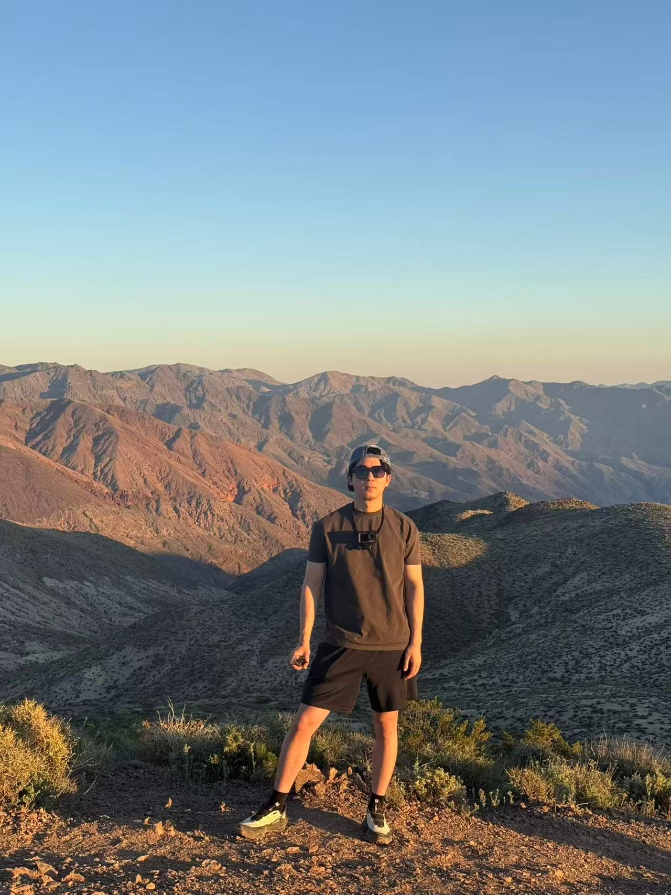

## Hobbies

I enjoy staying active and exploring new places in my free time. Fitness is an important part of my routine because it helps me stay disciplined, energized, and focused. I also love traveling, especially when I have the chance to experience dramatic landscapes and memorable views.

One of my most recent trips was to Death Valley, which was an unforgettable experience. The scenery was vast, quiet, and unlike anywhere I had been before. This photo captures a moment from that trip and reminds me why I enjoy traveling so much.

{fig-alt="A recent photo from my trip to Death Valley." width="70%"}
